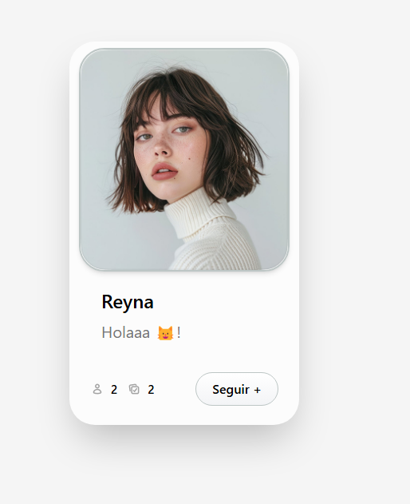

# Leccion 01 - Intro a React

## Proyecto - Creando una Tarjeta de Presentación con React

El objetivo de este workshop es aprender a:

1. Crear un proyecto de React con Vite.
2. Definir y usar componentes funcionales en React.
3. Entender la sintaxis básica de JSX.
4. Renderizar información estática en la interfaz.
5. Ejecutar y probar la aplicación en el navegador.

Workshop: Creando una Tarjeta de Presentación con React:

Vamos a construir una tarjeta de presentación en React para practicar la creación de componentes básicos y la estructura de JSX. La tarjeta mostrará información estática como el nombre, la profesión y un breve mensaje de presentación. Este ejercicio ayudará a comprender cómo funciona JSX y la organización de componentes en React.

## Estructura del repositorio

- `./practica-leccion/`: Contenido de la práctica
- `./practica-leccion/src/components/`: Componentes de la práctica en React
- `./practica-leccion/src/assets/`: Imagenes usadas en la práctica

- `./notas-clase/`: Notas de la clase

- `./capturas/`: Capturas de pantalla del proyecto


## Tecnologias

- Vite
- Typescript
- TailwindCSS
- HTML5

## Aprendizajes

- El porque se usa React
- Componentes de React
- Fragments
- Props
- Estado en React
- Typescript
- TailwindCSS


## Evidencia visual

A continuación se muestra una captura de pantalla del proyecto funcionando:




## Ejemplo de uso

1. Entra a la carpeta del proyecto:

```bash
cd ./practica-leccion
```

2. Instala dependencias:

```bash
npm install
```

3. Inicia el servidor de desarrollo:

```bash
npm run dev
```

4. Abre en el navegador la URL que te muestre Vite (en mi caso fue `http://localhost:5173`).


## Despliegue

Se desplegó en Netlify a partir de este repositorio, puede ver la página a través del siguiente link:
https://darling-blini-f9cf9b.netlify.app/

## Como conclusión personal:

En esta práctica pude aprender demasiado sobre React, el para que sirve y como usarlo, de mi parte en estas vacaciones estuve tratando de aprender un poco de Typescript y TailwindCSS y en esta práctica traté de hacer uso de ellos :D el ejercicio pedía realizar un componente de una tarjeta de presentación, me basé en el siguiente diseño:


No me quedó exactamente igual, pero me gustó mucho el poder usar estas 3 herramientas a pura mano propia para realizar algo ;u;!
De paso, realicé el despliegue en Netlify, ya que creo que en Github pages no funciona el despliegue de React como tal

Muchas gracias por la clase!!!