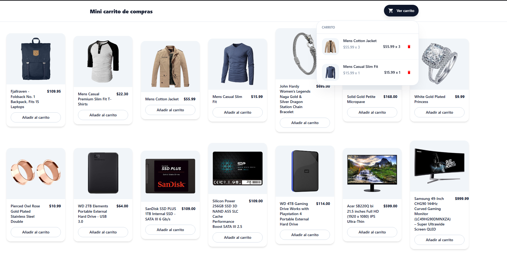

# Leccion 02 - Manejo de Estado

## Proyecto: Lista de Compras Interactiva

Los Hooks en React revolucionaron la forma en que los desarrolladores manejan el estado y el ciclo de vida en los componentes. En particular, `useState` es un Hook fundamental que permite a los componentes funcionales gestionar su propio estado de manera sencilla y eficiente. Su uso es esencial para cualquier aplicación React, desde proyectos pequeños hasta aplicaciones web complejas.

- Objetivo
El objetivo de este proyecto es crear una lista de compras interactiva usando `useState`. El usuario podrá agregar productos a la lista y eliminarlos cuando lo desee. Esto ayudará a comprender cómo manejar arreglos en el estado y cómo actualizarlo de manera eficiente.

- Proyecto: Lista de Compras Interactiva
Imagina que vas al supermercado y necesitas llevar un control de los productos que compras. En lugar de usar lápiz y papel, quieres una aplicación web sencilla que te permita agregar productos a una lista y eliminarlos cuando ya los has comprado. La aplicación debe ser intuitiva, permitiendo a los usuarios visualizar su lista de compras en tiempo real.

## Estructura del repositorio

- `./practica-leccion/`: Contenido de la práctica

- `./notas-clase/`: Notas de la clase

- `./capturas/`: Capturas de pantalla del proyecto

- `./img-repo/`: Imágenes para el repositorio

## Tecnologias

- Vite
- Typescript
- TailwindCSS
- HTML5


## Aprendizajes

- useState
- useEffect
- Inmutabilidad
- Uso de props
- Typescript
- TailwindCSS


## Evidencia visual

A continuación se muestra una captura de pantalla del proyecto funcionando:




## Ejemplo de uso

1. Entra a la carpeta del proyecto:

```bash
cd ./practica-leccion
```

2. Instala dependencias:

```bash
npm install
```

3. Inicia el servidor de desarrollo:

```bash
npm run dev
```

4. Abre en el navegador la URL que te muestre Vite (en mi caso fue `http://localhost:5173`).


## Despliegue

Se desplegó en Netlify a partir de este repositorio, puedes ver la página a través del siguiente link:
https://elaborate-llama-15b97d.netlify.app/

## Como conclusión personal:

En esta práctica pude aprender sobre el uso de state y el hook de useState :D
Traté de implementarlo con Typescript y por lo mismo, siento que se me hizo un poco complicado tratar de evitar romper la inmutabilidad al momento de querer añadir un elemento o eliminarlo del carrito
Otra cosa dificil para mi fue el como aplicar el useEffect para obtener datos de una API (esto me traté de adelantar y vi algunos videos pero casi casi no lo terminé de entender del todo x-x) aunque al final pude solucionar los errores! (que más que nada era de types y el como aplicar el useEffect bien para obtener los datos de la API)
De API usé la de "fakestoreapi", la cual brindaba bastantes productos con los que pude hacer la práctica ;w;
Por el lado del diseño me traté de basar en otra landing page que había visto pero al final de a tiro, no quedó nada igual JAJAJA pero sirvió para aprender bastante ;u;
Muchas gracias de verdad por la clase :'D!
