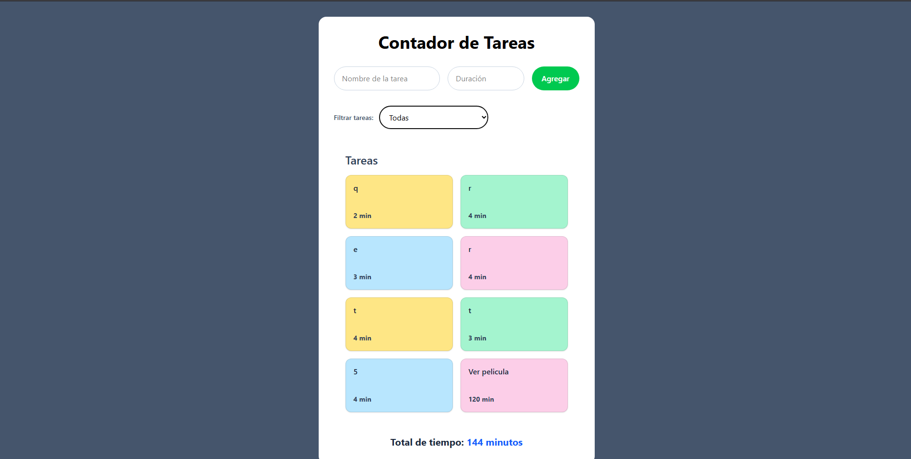
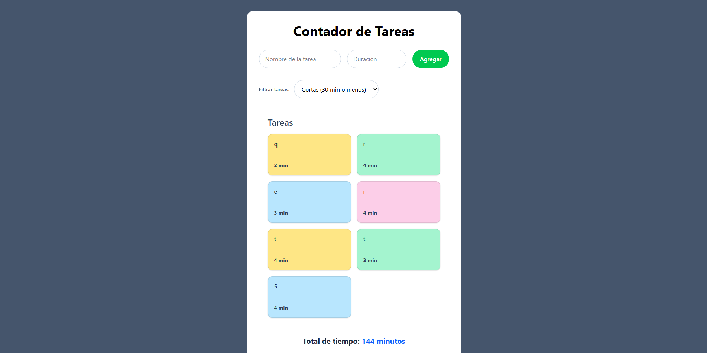
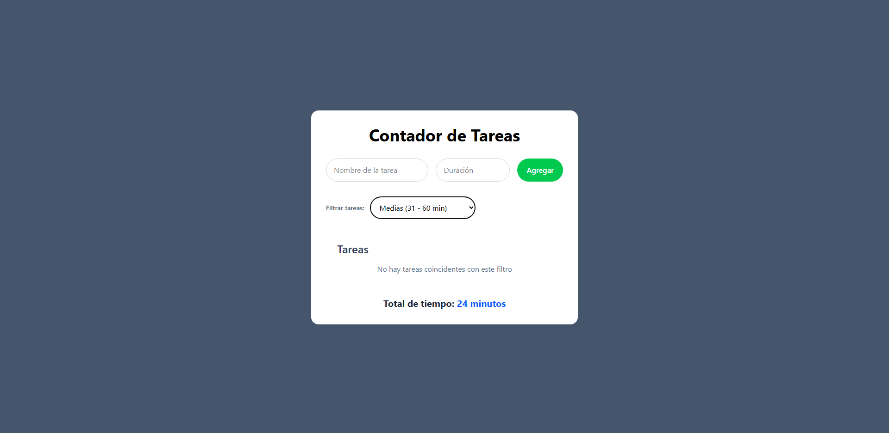
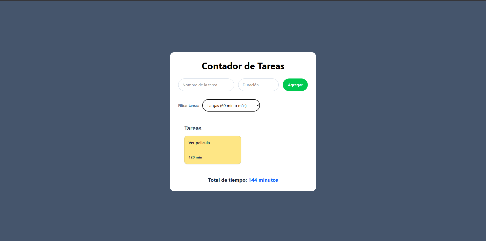

# Leccion 03 - Hooks useEffect y useMemo

## Proyecto: Creación de un Proyecto Contador de Tareas

En este workshop, vamos a construir una pequeña aplicación en React que simule un "contador de tiempo" donde los usuarios pueden realizar un seguimiento de un conjunto de tareas. Además, utilizaremos `useEffect` para gestionar los efectos secundarios y `useMemo` para optimizar el rendimiento al procesar una lista de tareas.

- Objetivo
El objetivo de este workshop es aprender a utilizar los hooks `useEffect` y `useMemo` dentro de un proyecto de React. Al finalizar, serás capaz de:

1. Practicar la creación de un proyecto React utilizando `Vite`.
2. Utilizar `useEffect` para realizar efectos secundarios (como el manejo de la hora en la interfaz).
3. Utilizar `useMemo` para evitar cálculos innecesarios de las horas totales cuando no cambian las tareas.


- Proyecto/Taller: Creación de un Proyecto Contador de Tareas
Imagina que estamos desarrollando una aplicación sencilla para llevar un seguimiento de las tareas y calcular el tiempo total que una persona ha dedicado a cada tarea. Queremos asegurarnos de que los cálculos de tiempo solo se realicen cuando sea necesario, y no cada vez que el componente se renderice. Aquí es donde entran los hooks `useEffect` y `useMemo`.

## Estructura del repositorio

- `./practica-leccion/`: Contenido de la práctica

- `./notas-clase/`: Notas de la clase

- `./capturas/`: Capturas de pantalla del proyecto

- `./img-repo/`: Imágenes para el repositorio

## Tecnologias

- Vite
- Typescript
- TailwindCSS
- HTML5


## Aprendizajes

- useEffect
- useMemo
- Arreglos de dependencias
- Typescript
- TailwindCSS


## Evidencia visual

A continuación se muestra una captura de pantalla del proyecto funcionando:







## Ejemplo de uso

1. Entra a la carpeta del proyecto:

```bash
cd ./practica-leccion
```

2. Instala dependencias:

```bash
npm install
```

3. Inicia el servidor de desarrollo:

```bash
npm run dev
```

4. Abre en el navegador la URL que te muestre Vite (en mi caso fue `http://localhost:5173`).


## Despliegue

Se desplegó en Netlify a partir de este repositorio, puedes ver la página a través del siguiente link:
https://effortless-faun-e911d6.netlify.app/

## Como conclusión personal:

En esta práctica pude aprender sobre useEffect y useMemo, siendo ambos hooks bastante importantes, tanto para cambiar algo dependiendo de otra cosa, como para mejorar el rendimiento de algo que podría ser costoso, del primero en la práctica anterior lo pude usar como para llamar a una API al inicio de una aplicación y de useMemo creo que también se podría usar como para calcular algo con un reduce y evitarse recalcularlo en caso de que no cambie un valor de dependencia ;u; voy a tratar de aplicar ambos más seguido para interiorizar mejor su uso!
