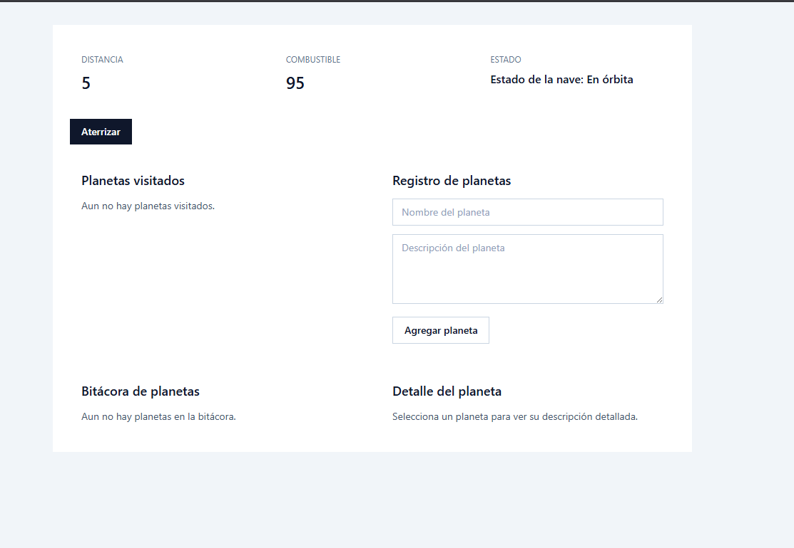
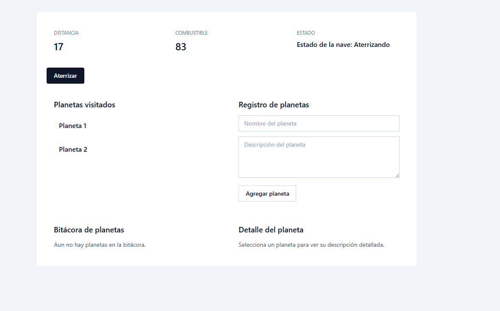
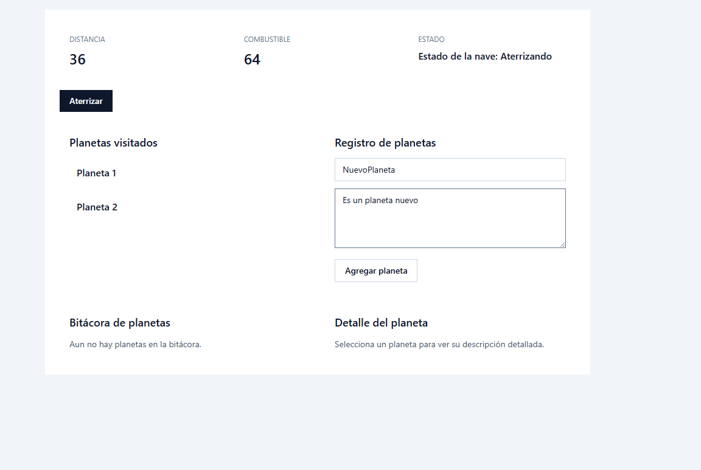
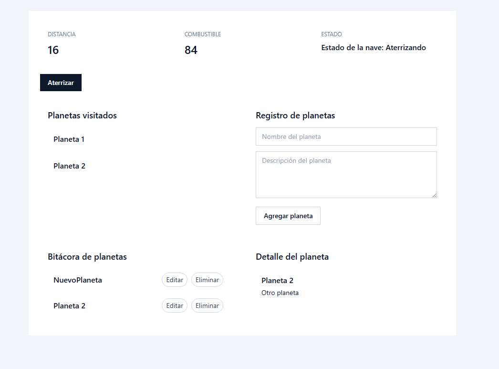
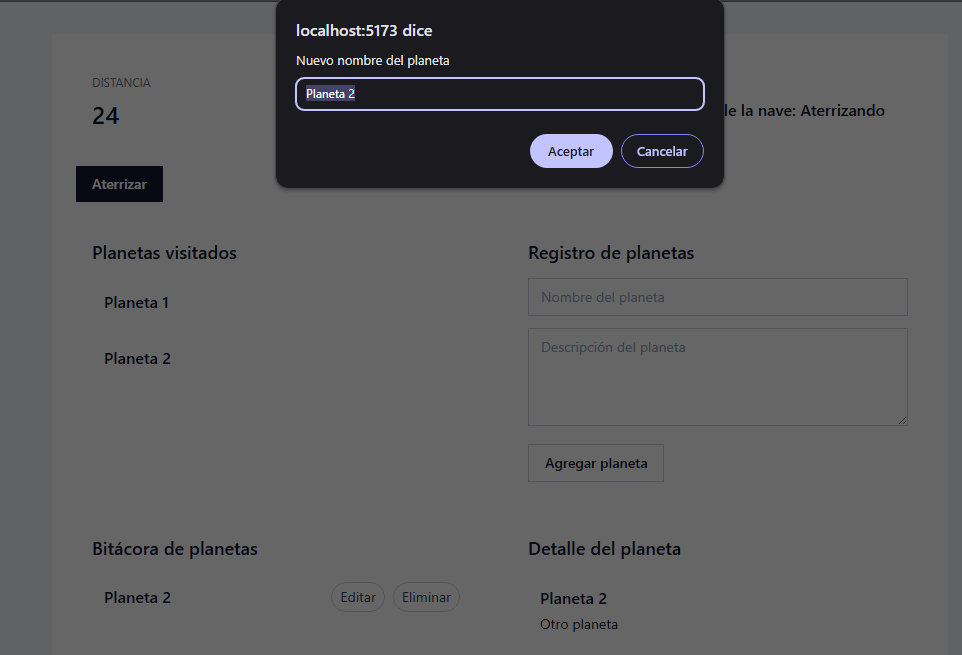
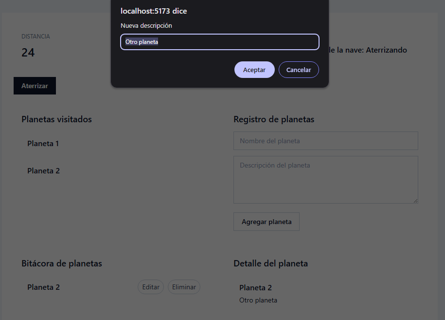
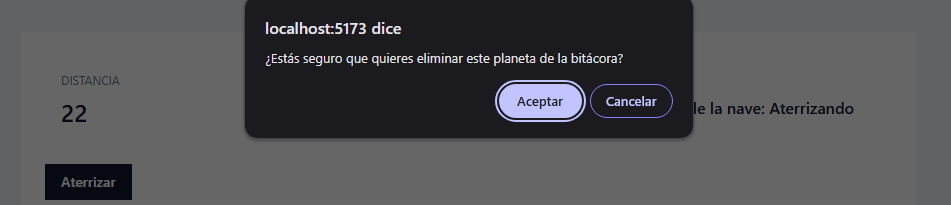

# Leccion 04 - Ciclo de vida de Componentes

## Proyecto
Comprender el ciclo de vida de los componentes funcionales en React es fundamental para desarrollar aplicaciones robustas y eficientes. Al utilizar los hooks como useEffect, podemos simular las etapas clave del ciclo de vida y realizar acciones específicas en cada etapa.

- Objetivo
En este proyecto practicarás el uso de algunos hooks de React (`useState`, `useEffect`, `useMemo`) para:

1. Gestionar el estado.
2. Ejecutar efectos secundarios (simulando el vuelo).
3. Optimizar cálculos con `useMemo`.
4. Comprender el ciclo de vida: montaje, actualización y desmontaje.

- Taller: El Viaje del Explorador Espacial
Imagina que eres un explorador espacial que construye un panel de control para tu nave. Este panel muestra información crucial del viaje: distancia, combustible, estado de la nave y planetas visitados. ¡Pero esta vez, te enfocarás en entender el ciclo de vida de tus componentes!

- Instrucciones para el workshop/taller:

1. Te proporcionamos un recurso base para poder llevar el taller por tu cuenta. Lo puedes consultar en el siguiente enlace: https://gist.github.com/heladio-devf-mx/9e04744fca14961787317a1742d5411f.

2. Te recomendamos que termines el taller como lo hemos planteado y depués intentes crear algo adicional y novedoso.

3. Experimenta con distintos escenarios a los que se plantean y asegúrate de que funcione como deseas, incluso puedes crear conponentes funcionales personalizados según lo que quieras conseguir.


## Estructura del repositorio

- `./practica-leccion/`: Contenido de la práctica

- `./notas-clase/`: Notas de la clase

- `./capturas/`: Capturas de pantalla del proyecto

- `./img-repo/`: Imágenes para el repositorio

## Tecnologias

- React
- Vite
- Typescript
- TailwindCSS
- HTML5


## Aprendizajes

- Ciclo de vida de los componentes de React

## Evidencia visual

A continuación se muestra una captura de pantalla del proyecto funcionando:










## Ejemplo de uso

1. Entra a la carpeta del proyecto:

```bash
cd ./practica-leccion
```

2. Instala dependencias:

```bash
npm install
```

3. Inicia el servidor de desarrollo:

```bash
npm run dev
```

4. Abre en el navegador la URL que te muestre Vite (en mi caso fue `http://localhost:5173`).


## Despliegue

Se desplegó en Netlify a partir de este repositorio, puedes ver la página a través del siguiente link:
https://fantastic-faun-444d1a.netlify.app/

## Como conclusión personal:

En esta práctica pude aprender sobre el ciclo de vida de los componentes de React, fue un tema que estuvimos viendo en clase y al principio se me hacía complicado de entender, pero al momento que estuve viendo con más calma los ejercicios que estuvimos viendo en clase, fue que lo logré entender más en conjunto con esta práctica :'D
