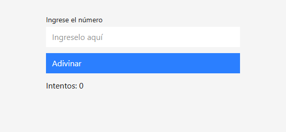
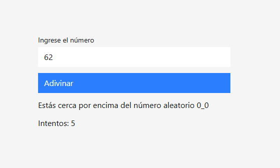
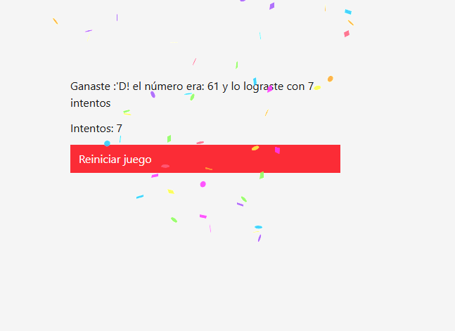

# Leccion 05 - Conditional Rendering y Components Composition

## Proyecto de Conditional Rendering y Components Composition
En React, el 'Conditional Rendering' o renderizado condicional se refiere a la capacidad de mostrar o esconder componentes en la interfaz de usuario según ciertas condiciones. Esta es una característica fundamental en el desarrollo de aplicaciones interactivas, ya que permite modificar la interfaz dinámicamente en respuesta a eventos o estados. Por otro lado, la composición de componentes es un concepto fundamental en React que permite construir interfaces reutilizables y modulares,en lugar de crear componentes monolíticos y difíciles de mantener.

- Objetivo
El objetivo de este taller es que los estudiantes practiquen la renderización condicional y la composición de componentes en React creando un pequeño juego interactivo. Al final, el usuario podrá ingresar un número y recibir retroalimentación dinámica hasta acertar.

- Proyecto/Taller: Adivina el Número
En este workshop, crearemos un juego interactivo llamado "Adivina el Número". El juego generará un número aleatorio y el usuario deberá adivinarlo. Dependiendo de la respuesta del usuario, se mostrará un mensaje de éxito o una pista para seguir intentando. Utilizaremos **conditional rendering** para mostrar diferentes mensajes y **composición de componentes** para estructurar la interfaz de manera modular.

Instrucciones para el workshop/taller:

1. Te proporcionamos un recurso de guía para poder llevar el taller por tu cuenta. Lo puedes consultar en el siguiente enlace: https://gist.github.com/heladio-devf-mx/7d68a7007135bdd4075a2e5837ad93d7

2. En este caso el reto es que practiques lo aprendido haste el momento y que intentes crear desde cero los componentes y la lógica para implementar la solución.

3. Te recomendamos que termines el taller como lo hemos planteado y depués intentes crear algo adicional y novedoso.

4. Experimenta con distintos escenarios a los que se plantean y asegúrate de que funcione como deseas, incluso puedes crear conponentes funcionales personalizados según lo que quieras conseguir.


## Estructura del repositorio

- `./practica-leccion/`: Contenido de la práctica

- `./notas-clase/`: Notas de la clase

- `./capturas/`: Capturas de pantalla del proyecto

- `./img-repo/`: Imágenes para el repositorio

## Tecnologias

- React
- Vite
- Typescript
- TailwindCSS
- HTML5


## Aprendizajes

- Composición de componentes
- Conditional rendering


## Evidencia visual

A continuación se muestra una captura de pantalla del proyecto funcionando:






## Ejemplo de uso

1. Entra a la carpeta del proyecto:

```bash
cd ./practica-leccion
```

2. Instala dependencias:

```bash
npm install
```

3. Inicia el servidor de desarrollo:

```bash
npm run dev
```

4. Abre en el navegador la URL que te muestre Vite (en mi caso fue `http://localhost:5173`).


## Despliegue

Se desplegó en Netlify a partir de este repositorio, puedes ver la página a través del siguiente link:
https://superb-strudel-6e02c7.netlify.app/

## Como conclusión personal:

En esta clase pude aprender sobre composición de componentes y conditional rendering, siento que ambos se me hicieron un poco complicados de entender, un poquito al inicio el conditional rendering usando &&, ya que esta sintaxis se me hacía un poco rara jsjs, normalmente pensé que se haría con ternario ;u; pero basicamente es como un "if" sin el "else", `!won && <h1>Ganó</h1>` es como "si won es falso, entonces se mostrará un h1 con el texto ganó" y la composición de componentes en cierto punto me enredé un poco con la parte de children, pero al final del día tengo entendido es basicamente envolver elementos de html, que serán pasados como prop a un componente de React ;w;
Pude aprender demasiado en esta práctica e incluso pude añadir algo que quería saber hace mucho como se hacía, que era la animación de confetis ;u;
Muchas gracias por esta práctica y la clase!