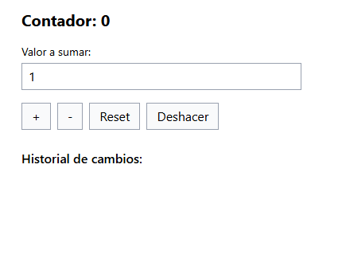

# Leccion 06 - Hooks avanzados en React

## Proyecto


## Estructura del repositorio

- `./practica-leccion/`: Contenido de la práctica

- `./notas-clase/`: Notas de la clase

- `./capturas/`: Capturas de pantalla del proyecto

- `./img-repo/`: Imágenes para el repositorio

## Tecnologias


## Aprendizajes


## Evidencia visual

A continuación se muestra una captura de pantalla del proyecto funcionando:




## Ejemplo de uso

1. Entra a la carpeta del proyecto:

```bash
cd ./practica-leccion
```

2. Instala dependencias:

```bash
npm install
```

3. Inicia el servidor de desarrollo:

```bash
npm run dev
```

4. Abre en el navegador la URL que te muestre Vite (en mi caso fue `http://localhost:5173`).


## Despliegue

Se desplegó en Github Pages a partir de este repositorio, puedes ver la página a través del siguiente link:
https://mor4n.github.io/06-introduccion-a-react/06-hooks-avanzados

## Como conclusión personal:


