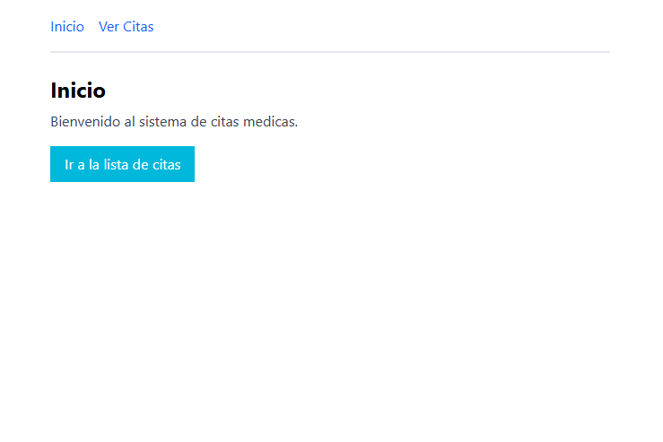

# Leccion 07 - Manejo de Rutas

## Proyecto de Hooks avanzados en React

Los hooks avanzados useRef y useCallback son herramientas poderosas en React que permiten mejorar el rendimiento y la gestión de referencias dentro de los componentes. useRef es útil para almacenar referencias mutables sin causar re-render, mientras que useCallback evita la recreación innecesaria de funciones. Finalmente el hook useReducer es una herramienta poderosa cuando se trabaja con estados complejos en React. Su uso es especialmente recomendable cuando useState se vuelve difícil de manejar o cuando se requiere una lógica más predecible y organizada para modificar el estado.

- Objetivo
Al finalizar este taller, los alumnos podrán:

1. ✅ Utilizar `useReducer` para manejar estados complejos.
2. ✅ Implementar `useRef` para interactuar con elementos del DOM.
3. ✅ Aplicar `useCallback` para optimizar funciones en React.
4. ✅ Crear una aplicación funcional en React con Vite.

Proyecto/Taller: Juego de Contador y Registro de Eventos o Gestor de Inventario
Vamos a construir una aplicación en React que incluya un **contador interactivo** o un **gestor de inventario para una tienda de e-commerce**, donde el reto es entender cómo cada hook mejora la eficiencia y estructura del código usando los hooks avanzados que hemos aprendido.

Instrucciones para el workshop/taller:

1. Te proporcionamos un recurso base para poder llevar el taller por tu cuenta. Lo puedes consultar en el siguiente enlace: https://gist.github.com/heladio-devf-mx/997e700a03762c892a84f76e1491845a.

2. Te recomendamos que termines el taller como lo hemos planteado y depués intentes crear algo adicional y novedoso. En este caso tienes dos opciones para elegir la que más te emocione. Puedes hacer solo una o las dos. Entre más practiques, mejor. 😊 💻 🤘🏾

3. Experimenta con distintos escenarios a los que se plantean y asegúrate de que funcione como deseas, incluso puedes crear conponentes funcionales personalizados según lo que quieras conseguir.

## Estructura del repositorio

- `./practica-leccion/`: Contenido de la práctica

- `./notas-clase/`: Notas de la clase

- `./capturas/`: Capturas de pantalla del proyecto

- `./img-repo/`: Imágenes para el repositorio

## Tecnologias

- React
- Vite
- Typescript
- TailwindCSS
- HTML5


## Aprendizajes


## Evidencia visual

A continuación se muestra una captura de pantalla del proyecto funcionando:




## Ejemplo de uso

1. Entra a la carpeta del proyecto:

```bash
cd ./practica-leccion
```

2. Instala dependencias:

```bash
npm install
```

3. Inicia el servidor de desarrollo:

```bash
npm run dev
```

4. Abre en el navegador la URL que te muestre Vite (en mi caso fue `http://localhost:5173`).


## Despliegue

Se desplegó en Netlify a partir de este repositorio, puedes ver la página a través del siguiente link:
https://mor4n.github.io/06-introduccion-a-react/07-manejo-rutas

## Como conclusión personal:


