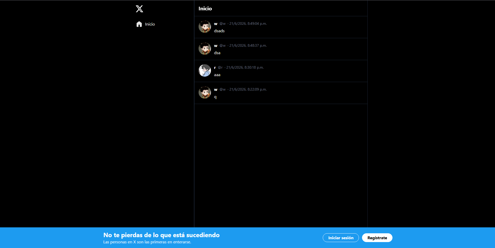

# Leccion 08 - Proyecto Final Intro a React

## Objetivo
El objetivo principal es añadir un sistema de autenticación robusto (simulado por el momento) a nuestro clon de Twitter. Esto implica:

1. Permitir a los usuarios registrarse e/o iniciar sesión.
2. Almacenar y gestionar la información de los usuarios de forma segura.
3. Proteger ciertas rutas y funcionalidades para que solo sean accesibles para usuarios autenticados.
Proyecto: Autenticación y Protección de Rutas en el Clon de Twitter
Nuestro clon simplificado de Twitter permite a los usuarios interactuar con la línea de tiempo y publicar tweets, pero carece de un sistema de autenticación. Esto significa que cualquier persona puede acceder a la aplicación y realizar acciones sin restricciones. Necesitamos implementar un sistema de autenticación para controlar el acceso a ciertas páginas y funcionalidades, asegurando que solo los usuarios registrados puedan realizar ciertas acciones.

Instrucciones para el workshop/taller:

1. Te proporcionamos un recurso base para poder llevar el taller por tu cuenta. Lo puedes consultar en el siguiente enlace: https://gist.github.com/heladio-devf-mx/4d8caf69dc4d147d514ff923cfc29a07

2. Te sugerimos tomar como base el proyecto de la última lectura del módulo y adaptarlo con el contenido de este taller.

3. Experimenta con distintos escenarios a los que se plantean y asegúrate de que funcione como deseas, incluso puedes crear conponentes funcionales personalizados según lo que quieras conseguir.

## Estructura del repositorio

- `./practica-leccion/`: Contenido de la práctica

- `./notas-clase/`: Notas de la clase

- `./capturas/`: Capturas de pantalla del proyecto

- `./img-repo/`: Imágenes para el repositorio

## Tecnologias

- React
- Vite
- Typescript
- TailwindCSS
- HTML5


## Aprendizajes


## Evidencia visual

A continuación se muestra una captura de pantalla del proyecto funcionando:




## Ejemplo de uso

1. Entra a la carpeta del proyecto:

```bash
cd ./practica-leccion
```

2. Instala dependencias:

```bash
npm install
```

3. Inicia el servidor de desarrollo:

```bash
npm run dev
```

4. Abre en el navegador la URL que te muestre Vite (en mi caso fue `http://localhost:5173`).


## Despliegue

Se desplegó en Netlify a partir de este repositorio, puedes ver la página a través del siguiente link:
https://mor4n.github.io/06-introduccion-a-react/08-proyecto-final

## Como conclusión personal:


